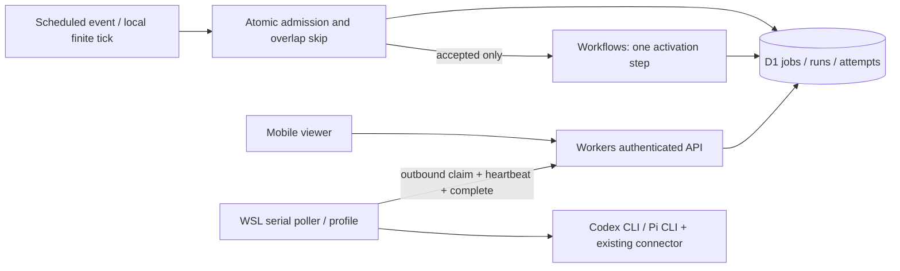

# Architecture and safety boundary

No dedicated agent framework, no automatic tool execution, no model-approved actions. Both current profiles require the WSL executor. A future lightweight Worker executor can implement the same job contract; choosing it requires an explicit capability/routing rule, not an assumption that Workflows automatically selects it. An agent graph (including a future LangGraph Runner) is separate from scheduling/leases/admission/auth.

## State and concurrency

- Job = immutable task + finite schedule. A run is one `(job_id, slot)` occurrence. An attempt is one lease token. Small output artifacts live in the run result field; no separate artifact service.
- Due slots are deterministic and unique. Atomic admission happens before Workflow creation. Same-job starting/queued/running or unacknowledged capacity reservations cause a skipped record, and no new Workflow. Only the current slot is considered; missed slots are never caught up. Skip records are bounded by maxRuns=10. A pending-start outbox and deterministic Workflow ID recover scheduler death between admission and Workflow creation. No infinite child jobs or recursion; the one Workflow step has at most two retries.
- Claim is one conditional SQL UPDATE with model and auth-group occupancy checks. D1 serializes the mutation. Owner isolation is part of every operation. Claims also enforce a per-owner 40-attempt/day budget and one active reservation per worker id.
- Lease is 20 seconds with 5-second heartbeat; absolute execution deadline 60 seconds. Reclaim waits until **deadline + 3 seconds**, even if heartbeat expires earlier. Each subprocess runs under Linux GNU `timeout --signal=KILL`, which survives poller death; local cancellation also kills its process group. This conservative hold prevents an orphan call and its replacement overlapping in the normal Linux failure model.
- Completion requires owner + worker + token + live lease/deadline. Equal duplicate reports are harmless; conflicting/old-token reports are rejected. A provider failure is terminal, so it does not silently consume another paid attempt. Only abandoned lease attempts are reacquired, up to 2 attempts total. This is at-least-once external inference, not exactly once: a completed remote inference whose acknowledgement is lost can consume quota twice.
- Cancel changes the visible state immediately, but **does not release capacity**. A trusted worker reports after its CLI closes, releasing the cancelled reservation without publishing output. Otherwise the reservation remains until deadline + grace. Disable atomically prevents further slots and cancels existing queued/running ones.
- Model/group upper limits accept integers 0..16. Zero stops new claims. Limits are global within this D1 instance, and group IDs must reflect actual shared auth/subscription identity. Different provider/model profiles sharing one account can share a group.
- A machine pause/uninterruptible kernel process or provider-side processing after HTTP disconnect cannot be proven stopped by client leases. Capacity is a local execution bound, not a guarantee about remote vendor processing. Before production, use a dedicated managed worker process boundary and monitor orphan processes. Do not widen permissions or use external tools in these profiles.

## CLI boundary

Fixed executable and argv; job text only on stdin. No shell string, arbitrary executable/path/URL API, or implicit model fallback. Prompt max 4 KiB, persisted result max 16 KiB, combined child stdout/stderr max 256 KiB, runtime 60 seconds. JSON event completion is validated; tool events/error/incomplete output are rejected. No provider diagnostics/stderr are stored because they may contain secrets. CLI failure messages are normalized.

Codex ignores user config/rules, disables project instructions, shell, unified exec, patch tool, skills, hooks, apps, delegation and web search, uses read-only sandbox and forced ChatGPT auth. Pi disables all tools, context files, automatic extensions/skills/templates/themes, session saving and startup networking, and explicitly loads only the existing trusted Devin connector. No credentials are generated, copied or read by this app; CLI libraries own authentication. Environment is allowlisted; worker token and API-key overrides are excluded. Both run in an empty throwaway directory.

Model connections necessarily send the explicitly supplied task text to the selected model service. No other user data is intentionally read or posted. CLI implementations may write their own auth refresh, catalog/cache or operational logs. Empty throwaway directories are removed after execution. Provider outputs are untrusted text (`textContent` in UI), never approvals or executable instructions.

The CLI versions and flags are a compatibility boundary: keep versions validated before upgrades. The existing third-party `pi-devin-connector` encapsulates reverse-engineered provider details; this repo does not fork or maintain that protocol. Replacing it with the official Devin CLI is possible behind `invoke` but requires validating tools-off/config isolation first. No unofficial new connector was installed.

## Deferred scope and data

private-knowledge commit reading, INDEX interpretation, source citations, Git updates, code edits, external messaging, automatic approval and richer task graphs are out of this narrowed first acceptance. private-knowledge and development-memory were not changed or merged. Prompts, schedule and results are private D1 data; no analytics or CDN caching is added. Retention/export/deletion policy remains a production decision. There is no payment/account administration code, deployment command in CI, or enabled production cron.

## Official references checked 2026-10-01

- [Codex non-interactive mode](https://developers.openai.com/codex/non-interactive-mode)
- [Codex authentication](https://developers.openai.com/codex/auth)
- [Codex configuration](https://developers.openai.com/codex/config-reference/)
- [Devin CLI](https://docs.devin.ai/cli) and [configuration](https://docs.devin.ai/cli/reference/configuration/config-file)
- [Cloudflare Workflows local development](https://developers.cloudflare.com/workflows/build/local-development/)

Wrangler emulates Workflows locally. Successful local D1/Workflows execution does not establish production credentials, billing, deployment or global durability. Those remain untested until separately authorized.
