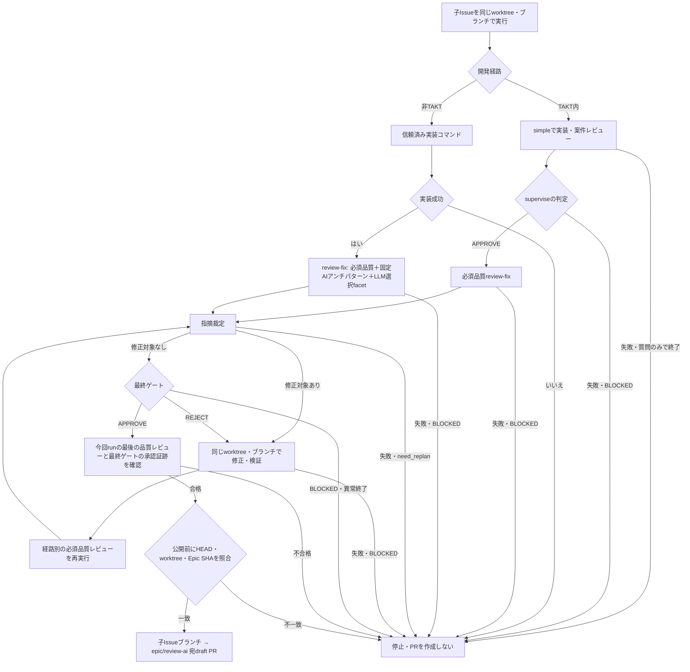

# PR前の品質レビューと修正

TAKT 0.68.0の`review-fix`を基底に、独自の広範品質レビューを必須実行する。CodeRabbit CLI/APIは使用しない。CodeRabbit型とは品質・セキュリティ・実装契約を広く確認する役割を指し、製品の品質と同等という意味ではない。

| 開発経路 | レビュー構成 |
| --- | --- |
| `external`（TAKT外で開発、通常はこちらを指定） | 広範品質＋既存AI antipatternを固定実行。architecture/frontend/backend/CQRS/security/testingはTAKTのLLM selectorが変更に応じて選択 |
| `takt`（TAKT内で案件レビュー済み） | 広範品質のみ。案件facetの重複実行を省く |

案件レビュー未完了の場合はTAKTでコードを書いていても`external`を選ぶ。`takt`は呼出し側の申告であり、過去runの受入を自動認証しない。いずれも広範品質をselectorのpoolに含めないため、選択候補が0件でも必ず実行する。

## 実行

```bash
npm ci
npm ci --prefix runtime/takt --ignore-scripts
npm run review:prepare -- --development external --project /absolute/target-worktree --task-file /absolute/review-task.txt
```

`--run`なしは設定生成・公式loaderによる子workflowを含む検証までで、モデルは呼ばない。実行する場合は同じ引数に`--run`を追加する。TAKT開発済みの場合は`--development takt`とする。taskファイルに案件要件、対象差分とbase ref、検証コマンド、変更してはいけない範囲を記載する。レビュー指摘に応じてコードを修正するため、対象は作業用worktreeを指定する。

```bash
npm run review:prepare -- --development takt --project /absolute/target-worktree --task-file /absolute/review-task.txt --run
```

実行は固定版の公式CLIへ`--pipeline --skip-git`で委譲する。commit/push/PR作成は行わない。既定は`examples/takt/config.yaml`・`runtime.yaml`のコピーを使用し、モデルとeffortを維持する。別の承認済み設定は`--config /absolute/config-directory`で指定する。元設定・グローバルTAKTには書き込まない。auto_prのみコピー上でfalseにする。

生成設定とsource hashはこの基盤リポジトリの`.local/review-runs/run-*/config`に保存する。実行レポート・選択snapshot・最終結果は公式TAKTの対象worktreeのrun記録を確認する。ソースやtaskを含み得るため、raw記録をGitへ追加しない。prepareの成功はレビュー合格ではない。

必須レビューの上書きを防ぐため、この入口では対象worktreeの`.takt/config.yaml`、`runtime.yaml`、`workflows`、`steps`、`facets`、`companions`、`facet-pools`との暗黙合成を拒否する。独立したworktree/設定で実行する。継承された`TAKT_*`環境設定も消去する。通常の認証環境は公式CLIが利用する。独自runtimeやglobal workflow overrideを自由に混ぜる入口ではない。

## 拡張点と合否

`review/prepare.mjs`が固定版builtinの`review-fix`と`development-review`から派生構成を作る。`peer-review`、指摘裁定、修正計画、動的修正facet、修正検証、loop監視、最終ゲートは既存TAKTに委譲し再実装しない。独自facetは`review/facets`。案件レビューは観点ごとの既存subagentを再利用する。

広範品質の`quality-review.md`は既存finding形式を使用する。根拠・影響・改善案・安定したfinding_idを要求し、好みと未検証の懸念をblockingから分離する。再レビューも同じ必須reviewerを実行し、裁定とnew/persists/resolvedを引き継ぐ。

レビュー単体のAPPROVEだけで終えず、指摘裁定を経て最終ゲートAPPROVEに到達して初めてreview-fixが完了する。REJECTは修正→検証→再レビュー、BLOCKED/need_replan/異常終了は不合格。CLIの終了コードとTAKTの最終結果・レポートを併せて確認する。

## 検証の範囲

`npm run test:review`は公式loader、公式WorkflowEngine＋mock providerを使用し、空選択でも必須実行、任意facetの選択、修正後の再レビュー、最終REJECTでの再修正、BLOCKED・無効なselector出力による失敗を検証する。モデルを起動せず、ルーティングと遷移の契約を検証する試験である。CIは固定TAKTをinstallした後に実行する。

実モデルによる検出精度・誤検知率・費用・CodeRabbitとの比較は未評価。運用受入では代表的な実PRと既知の欠陥を使って別途評価する。既存CodeRabbitサービスのmerge条件やwatch/D1統合の受入状態を、このfixture成功で置き換えない。

`--project`はHEADのあるGit worktreeのルートが必要。TAKT配下の子モデルでは共有メモリフックを無効にし、runごとのモデル出力を個別の共有journalとして保存しない。

## 子Issueの実装からEpic宛PRまで自動実行

子Issue用の入口は`npm run child-issue`。既存の子Issue worktreeを指定し、同じブランチで実装→必須レビュー→修正/検証/再レビュー→commit→push→Epic宛draft PRまで実行する。レビュー用の別ブランチを作らず、mainへは公開しない。



```bash
npm run child-issue -- \
  --project /absolute/child-issue-worktree \
  --repo FYuki/private-agent --issue 123 \
  --branch feature/issue-123 --epic epic/review-ai \
  --task-file /absolute/issue-123.txt --development takt --run
```

`--run`を外すと構成と公式loaderの検証のみ。対象worktreeは既に存在し、指定された子Issueブランチをcheckoutしている必要がある。Epicブランチはoriginに存在し、その最新HEADが子Issueの祖先であることを開始時に確認する。実行中にEpicが進んだ場合は公開前に停止する。起点を同期して再レビューする。

TAKT経路では固定版`simple`から生成した`private-agent-child-issue`を実行する。`supervise: APPROVE`の後に`private-agent-review-fix-takt`を自動呼出しするため、案件レビューは重複しない。`plan`で質問に答えただけのCOMPLETEは子Issue完了とせず停止する。最終review-fixが合格した場合だけホストが公開する。既存の`simple`や既存のwatch/D1 workerをグローバルに変更するものではなく、子Issueの起動をこの入口に切り替える。

非TAKT開発も自動連結する場合は、信頼した呼出し元から実装コマンドをargvのJSON配列で指定する。シェル文字列として実行せず、コマンドが成功終了した後に`private-agent-review-fix-external`を実行する。タスク本文やモデル出力から実行コマンドを取り出さない。

```bash
npm run child-issue -- \
  --project /absolute/child-issue-worktree \
  --repo FYuki/private-agent --issue 123 \
  --branch feature/issue-123 --epic epic/review-ai \
  --task-file /absolute/issue-123.txt --development external \
  --implementation-command '["node","/absolute/trusted-development-entry.mjs"]' --run
```

自動PRの条件は、今回の公式runが完了し、最後の広範品質レビューと最終ゲートがAPPROVEであること。単なるプロセスのexit0は採用しない。失敗、BLOCKED、step上限、実装コマンドの失敗はPR作成へ進まない。PRは指定repo内の`子Issueブランチ → epic/*`に限定し、既存PRのhead/base/SHAを照合する。force push・merge・Issue closeは実施しない。CI成功はPR作成後に別途確認する。

公開だけが失敗した場合は、出力されたrunDirを指定して再開できる。レビュー済みHEADとclean worktree、EpicのSHAが保存時と一致する場合だけ、pushとPR照合/作成を再試行する。既存PRがあれば再利用し、応答不明でも同じhead/base/SHAのPRを照合する。

```bash
npm run child-issue -- --resume-publication /absolute/runDir --run
```

同じworktreeの入口はローカルlockで重複実行を拒否する。異常終了で`.local/child-issue-runs/<hash>.lock`が残った場合は、対象プロセスが停止したことを確認してからそのlockだけを削除する。実行中のworktreeを他の編集プロセスと共有しない。run記録と承認済みHEADは基盤リポジトリの`.local/child-issue-runs`に保存する。

追加検証は公式Engineでの`simple → review-fix`自動遷移、公式実行APIのNDJSON合否証跡、質問のみでの停止、およびローカルbare Git＋GitHub stubでのEpic宛PR、応答不明の照合、変更後の再公開拒否を対象にする。実モデルとGitHubへの実push/PRの受入は別途実行が必要。
