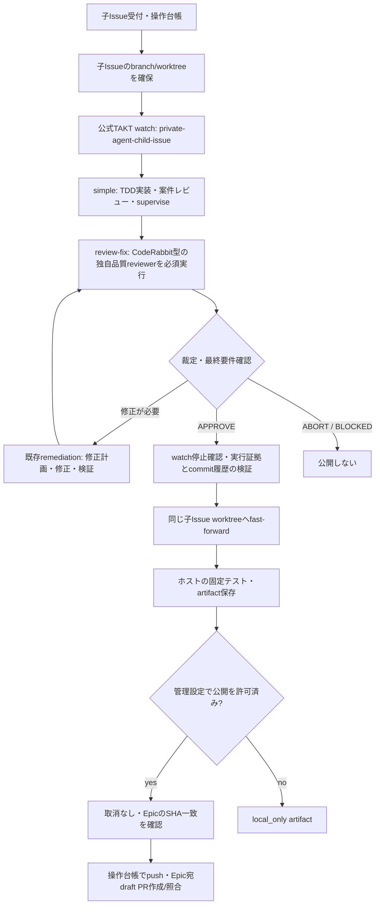

# watchから必須レビュー・draft PRへの接続

通常の`takt-watch` profileは、正常実モデルによる一連の受入が完了するまで利用不可。接続の受入は`watch-review-acceptance.ts`から行う。旧watchの開発用`default` / `simple`はrunnerの公開経路では拒否する。



CodeRabbit CLI・外部CodeRabbitサービスは呼ばない。TAKTで案件レビュー済みのため、ここでは案件facetを重複実行せず品質reviewerだけを必須にする。非TAKT開発の入口は既存`review/child-cli.mjs --development external`で、品質reviewer固定＋案件facet動的選択を使用する。

TAKTの内部cloneとホストの子Issue worktreeは別のディレクトリ。合格後のcommitを元の子Issueブランチへ取り込む。別の修正PRは作らず、そのブランチから指定Epicへdraft PRを作る。watch/モデルへGitHub公開用認証は渡さない。レビュー用Gitは固定baseのindex/objectsだけを読取専用で渡し、作業ツリーとの差分を参照させる。

## 再接続・取消・合格条件

既存の独立実行所有者がwatchを保持する。監視プロセス切断では再enqueueしない。再接続時は同じtaskの実行結果と操作台帳を照合する。公開済みなら同じPRを返し、応答不明のpush/PRは既存publisherで照合する。取消後は公開せず、停止確認前に占有枠を解放しない。

`workflow_complete`だけでは合格にしない。固定workflow参照、callの世代、必須quality-reviewのphase 3 `approved`、同じpeer-review内のfinal-gate `APPROVE`、外側callの正常完了を確認する。レビュー後に修正が入った場合は再レビューが必要。ホストでは変更許可パス・commit範囲・HEAD・作業ツリー・固定テストを確認する。公開直前のEpic SHAが受付時のbaseと異なる場合は止める。

## 実接続の受入入口

本人が指定した子IssueとEpicを使い、管理用JSONをローカルに作成する。`task`はdevelopment APIと同じ入力で、`executionProfileId: takt-watch`、`watch.workflow: private-agent-child-issue`、`watch.issue`、`validation`を指定する。`runner`は既存`DevelopmentRunnerConfig`（repository/worktrees、codexPackage/authFile/dependencies、taktRuntime/taktInputs/taktRunsを持つ`takt`）を使用する。対象repo/baseは既存registryの許可範囲に限る。

`publishAuthorized: true`は公開をあらかじめ許可した受入だけに設定する。指定しない場合はlocal_only。registryを使う場合は対象bindingの公開設定が優先する。認証情報の本文をJSONやGitへ保存しない。TAKT config/runtimeの原本は変更しない。

```sh
node --import tsx scripts/watch-review-acceptance.ts --live-authorized /absolute/private-config.json /tmp/acceptance-state
```

state directoryにSQLite・再接続用identity・evidenceを保存する。同じJSONとstateで再実行すると同じtaskへ戻る。別taskには別stateを使う。`taktRuns`は公式TAKTのファイル名上限に収まる短い絶対パスにする。監視期限`budgetMs`はモデルの寿命と別。モデル呼出回数・wall timeの上限は管理者が明示する場合だけ`takt.maxProviderCalls`/`watchLimits`へ指定し、旧試験の60分制限を一般運用へ持ち込まない。

## 検証の区別

- 公式loader/Engine: 必須reviewerの解決・修正ループ・質問のみ/blockedの拒否・実NDJSONの合格判定。
- namespace付き公式watch＋失敗stub: 再接続・tell・取消・Git参照の読取専用性。
- 実Git/worktree＋GitHub/provider置換: artifactからEpic draft PRの配線、重複防止、取消・base更新・不合格時の公開拒否。
- 正常実モデル→watch→artifact→実GitHub PR: 対象子Issueを指定して別途受入。上記fixture成功をこの実接続成功やCodeRabbit同等品質とは扱わない。
